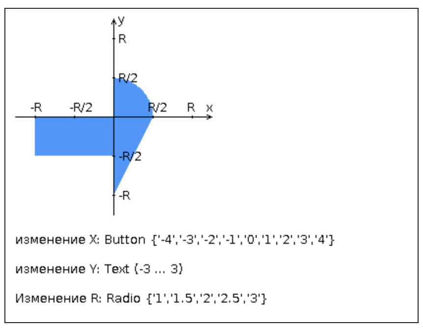
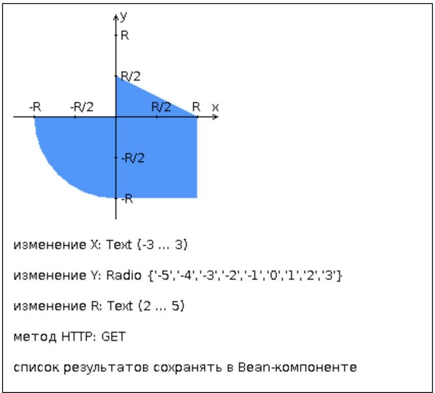
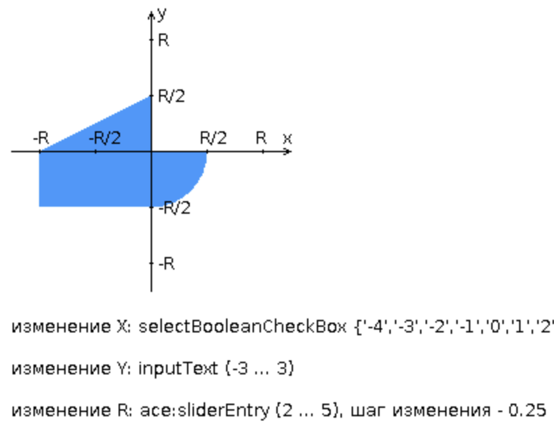

# сборка лаб по вебу
## Лаба-1 

### Задание

**Разработанная HTML-страница должна удовлетворять следующим требованиям:**

- Для расположения текстовых и графических элементов необходимо использовать блочную верстку. 💀💀💀💀💀
- Данные формы должны передаваться на обработку посредством POST-запроса.
- Таблицы стилей должны располагаться в самом веб-документе.💀💀💀💀💀
- При работе с CSS должно быть продемонстрировано использование селекторов классов, селекторов атрибутов, селекторов потомств, селекторов элементов а также такие свойства стилей CSS, как наследование и каскадирование.
- HTML-страница должна иметь "шапку", содержащую ФИО студента, номер группы и новер варианта. При оформлении шапки необходимо явным образом задать шрифт (serif), его цвет и размер в каскадной таблице стилей.
- Отступы элементов ввода должны задаваться в процентах.
- Страница должна содержать сценарий на языке JavaScript, осуществляющий валидацию значений, вводимых пользователем в поля формы. Любые некорректные значения (например, буквы в координатах точки или отрицательный радиус) должны блокироваться.

### Ответы/Подсказки
[HTTP](https://ru.wikipedia.org/wiki/HTTP)

[HTML](https://developer.mozilla.org/en-US/docs/Web/HTML)

[FAST-CGI](https://fastcgi-archives.github.io/fcgi2/doc/fcgi-java.htm)

[JavaScript](https://learn.javascript.ru) 

[CSS](https://developer.mozilla.org/ru/docs/Learn/Getting_started_with_the_web/CSS_basics)

[CSS GRID/FLEX](https://habr.com/ru/articles/528672/)

[Dockerfile](https://habr.com/ru/companies/ruvds/articles/439980/)

[Docker-compose](https://habr.com/ru/companies/ruvds/articles/450312/)

## Лаба-2

### Задание 

Разработать веб-приложение на базе сервлетов и JSP, определяющее попадание точки на координатной плоскости в заданную область.

**Приложение должно быть реализовано в соответствии с шаблоном MVC и состоять из следующих элементов:**

- ControllerServlet, определяющий тип запроса, и, в зависимости от того, содержит ли запрос информацию о координатах точки и радиусе, делегирующий его обработку одному из перечисленных ниже компонентов. Все запросы внутри приложения должны передаваться этому сервлету (по методу GET или POST в зависимости от варианта задания), остальные сервлеты с веб-страниц напрямую вызываться не должны.
- AreaCheckServlet, осуществляющий проверку попадания точки в область на координатной плоскости и формирующий HTML-страницу с результатами проверки. Должен обрабатывать все запросы, содержащие сведения о координатах точки и радиусе области.
- Страница JSP, формирующая HTML-страницу с веб-формой. Должна обрабатывать все запросы, не содержащие сведений о координатах точки и радиусе области.
**Разработанная страница JSP должна содержать:**

"Шапку", содержащую ФИО студента, номер группы и номер варианта.
- Форму, отправляющую данные на сервер.
- Набор полей для задания координат точки и радиуса области в соответствии с вариантом задания.
- Сценарий на языке JavaScript, осуществляющий валидацию значений, вводимых пользователем в поля формы.
- Интерактивный элемент, содержащий изображение области на координатной плоскости (в соответствии с вариантом задания) и реализующий следующую функциональность:
- Если радиус области установлен, клик курсором мыши по изображению должен обрабатываться JavaScript-функцией, определяющей координаты точки, по которой кликнул пользователь и отправляющей полученные координаты на сервер для проверки факта попадания.
В противном случае, после клика по картинке должно выводиться сообщение о невозможности определения координат точки.
- После проверки факта попадания точки в область изображение должно быть обновлено с учётом результатов этой проверки (т.е., на нём должна появиться новая точка).
- Таблицу с результатами предыдущих проверок. Список результатов должен браться из контекста приложения, HTTP-сессии или Bean-компонента в зависимости от варианта.

**Страница, возвращаемая AreaCheckServlet, должна содержать:**

- Таблицу, содержащую полученные параметры.
- Результат вычислений - факт попадания или непопадания точки в область.
- Ссылку на страницу с веб-формой для формирования нового запроса.

Разработанное веб-приложение необходимо развернуть на сервере WildFly. Сервер должен быть запущен в standalone-конфигурации, порты должны быть настроены в соответствии с выданным portbase, доступ к http listener'у должен быть открыт для всех IP.

### Ответы/Подсказки

[Jakarta Servlets](https://metanit.com/java/javaee/4.1.php)

[Jakarta JSP](https://metanit.com/java/javaee/3.1.php)

[Jakarta Bean](https://javatutor.net/articles/ejb-components-in-jsp-pages)

## Лаба-3 

### Задание 

Разработать приложение на базе JavaServer Faces Framework, которое осуществляет проверку попадания точки в заданную область на координатной плоскости.

Приложение должно включать в себя 2 facelets-шаблона - стартовую страницу и основную страницу приложения, а также набор управляемых бинов (managed beans), реализующих логику на стороне сервера.

**Стартовая страница должна содержать следующие элементы:**

- "Шапку", содержащую ФИО студента, номер группы и номер варианта.
- Интерактивные часы, показывающие текущие дату и время, обновляющиеся раз в 10 секунд.
- Ссылку, позволяющую перейти на основную страницу приложения.

**Основная страница приложения должна содержать следующие элементы:**

- Набор компонентов для задания координат точки и радиуса области в соответствии с вариантом задания. Может потребоваться использование дополнительных библиотек компонентов - ICEfaces (префикс "ace") и PrimeFaces (префикс "p"). Если компонент допускает ввод заведомо некорректных данных (таких, например, как буквы в координатах точки или отрицательный радиус), то приложение должно осуществлять их валидацию.
- Динамически обновляемую картинку, изображающую область на координатной плоскости в соответствии с номером варианта и точки, координаты которых были заданы пользователем. Клик по картинке должен инициировать сценарий, осуществляющий определение координат новой точки и отправку их на сервер для проверки её попадания в область. Цвет точек должен зависить от факта попадания / непопадания в область. Смена радиуса также должна инициировать перерисовку картинки.
- Таблицу со списком результатов предыдущих проверок.
- Ссылку, позволяющую вернуться на стартовую страницу.

**Дополнительные требования к приложению:**

- Все результаты проверки должны сохраняться в базе данных под управлением СУБД PostgreSQL.
- Для доступа к БД необходимо использовать ORM EclipseLink.
- Для управления списком результатов должен использоваться Session-scoped Managed Bean.
- Конфигурация управляемых бинов должна быть задана с помощью аннотаций.
- Правила навигации между страницами приложения должны быть заданы в отдельном конфигурационном файле.

### Ответы/Подсказки

нет ответов =(
